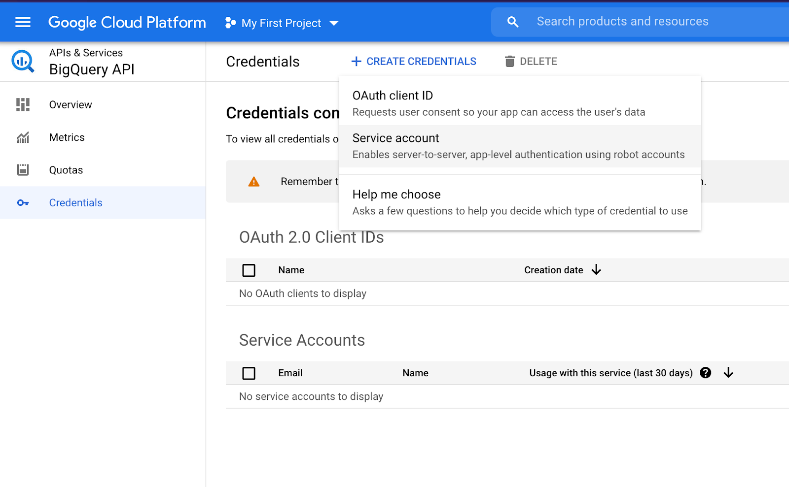
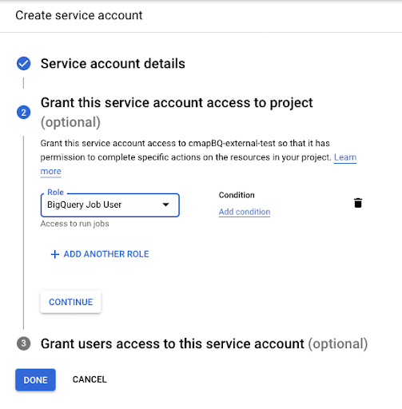
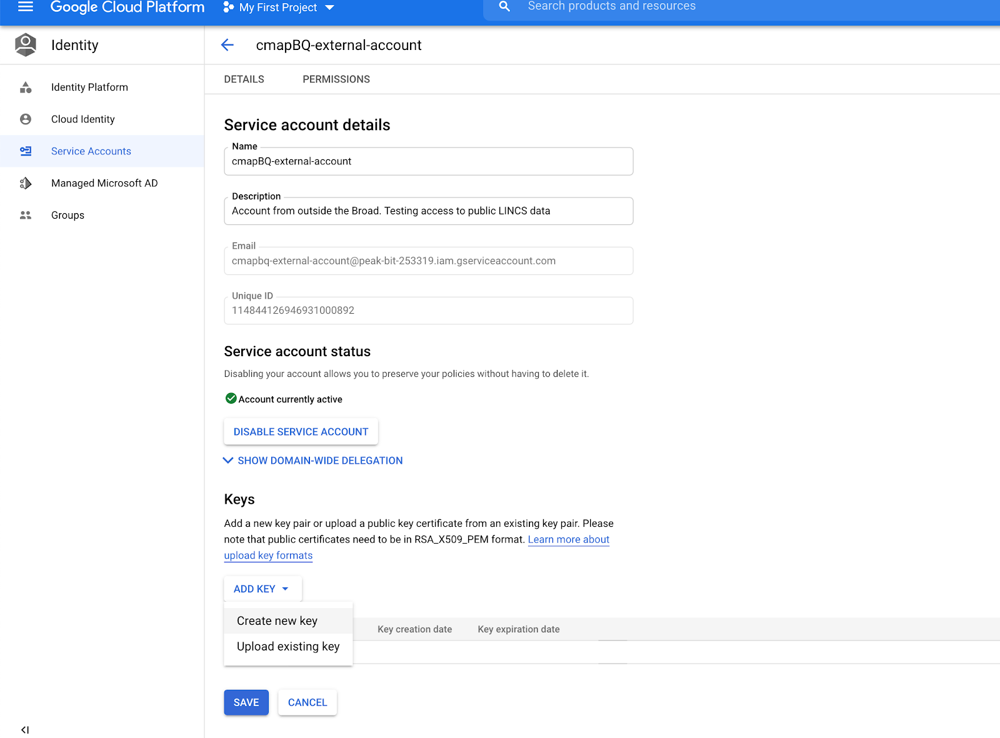

Using CMap's BQ Toolkit
=======================

Introduction
    The cmapBQ toolkit enables access to data hosted in Bigquery directly from a python session.

Instructions for installing cmapBQ
==================================
    
The cmapBQ package is available on Pypi and can be installed using the command:
    ``pip install cmapBQ``

Where to place your JSON service file
===================================== 

The recommended location for service account credentials is within the ``~/.cmapBQ`` folder.
The following command will populate that folder with a ``config.txt`` file that points to your credentials file.

.. code-block:: python
   :emphasize-lines: 4

   import cmapBQ.query as cmap_query
   import cmapBQ.config as cmap_config

   cmap_config.setup_credentials(path_to_json)

`Tutorial Notebook
<https://colab.research.google.com/github/cmap/lincs-workshop-2020/blob/main/BQ_toolkit_demo.ipynb>`_  available on `Github <https://github.com/cmap/lincs-workshop-2020>`_

Credential's setup
==================

To be able to access the dataset, register for a Google Cloud account.
After registration or if you already have an account, go to your Google Cloud console
and then activate your Google Cloud BigQuery API `(link) <https://console.cloud.google.com/apis/library/bigquery.googleapis.com>`_.

When you have access to your Google Cloud Account, go to APIs & Services > Credentials. Find the +Create Credentials and select “Service Account”.

Note: Depending on your organization or project, you may not have access to the credentials page. If that is the case,
discuss with the project admin to get your service account key, or create a new project in which you have permission.

Fill out service account details, make sure to set the Role to “BigQuery Job User”

After the service account has been created, find the Section labeled “Keys” and go to Add Key > Create new key. Select “JSON” format.

Place the downloaded JSON file in a safe location, for example, ~/.cmapBQ/ 
and run the following command in python once. 

.. code-block:: python
   :emphasize-lines: 4

   import cmapBQ.query as cmap_query
   import cmapBQ.config as cmap_config

   cmap_config.setup_credentials(path_to_json)

Note: For usage in Colab, JSON key can be uploaded and referenced from the file viewer in the left side menu
